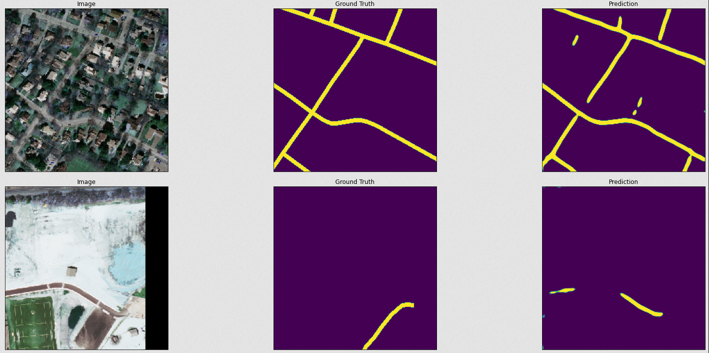

# Detecting-Roads-from-Satellite-Images

In this notebook we will look at satellite imagery data from Masachusetts and detect roads from the images. The dataset has been obtained from [kaggle](https://www.kaggle.com/insaff/massachusetts-roads-dataset)

The data is organized as follows:

```
.
└── training
    ├── input
    └── output
├── testing
│   ├── input
│   └── output
```

where input folder contains the images and output folder contains the corresponding mask images.

- The size of the images is: (length, width, color_channels) = (1500, 1500, 3)

- The two tasks in the analysis are:
      - Data Pipeline: Preprocessing the raw images to make them ready for the deep learning model
      -  Model Pipeline: Build a deep learning model to identify roads from the images

- Data pipeline does the following:
    - Crop input images from (1500, 1500, 3) into multiple smaller images of size (256, 256, 3)
    - Apply similar operation on the mask images
    - Save images as h5 files.

- Model pipeline does the following:
    - Trains a Unet model on the cropped images
    - Validates the model on test data using defined metrics
    
Here are some predictions from the model: 




